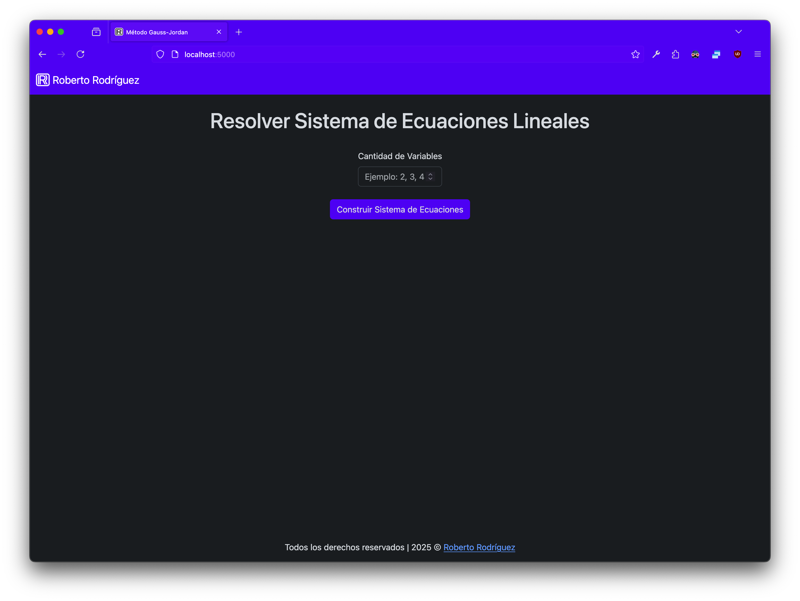
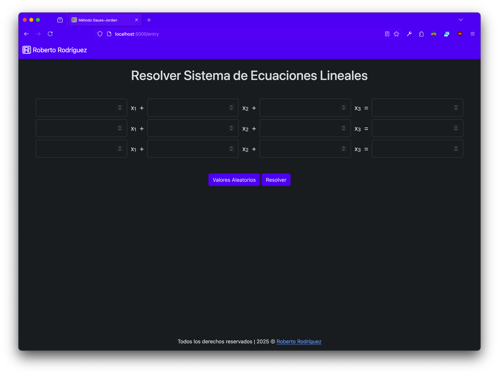
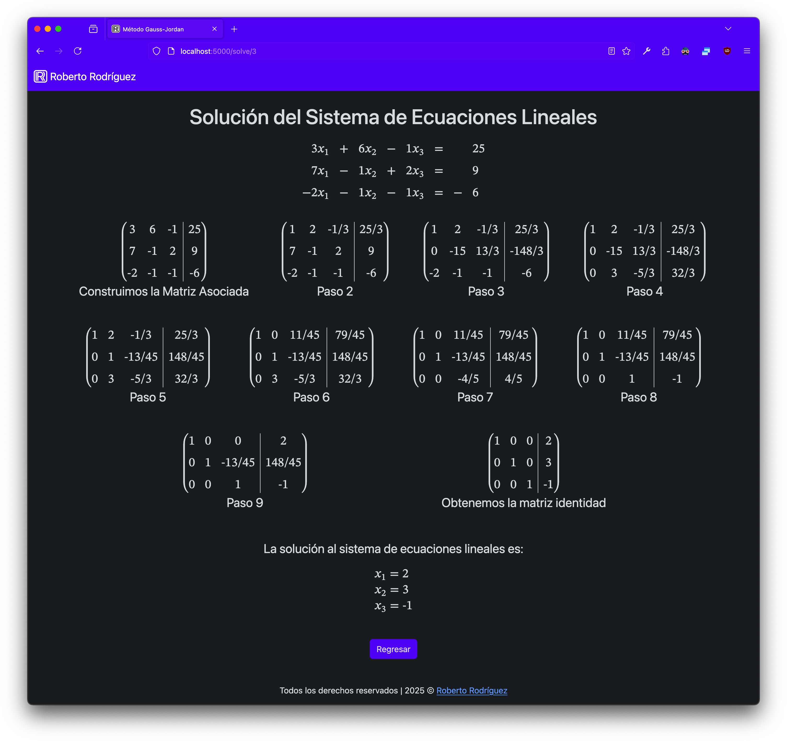
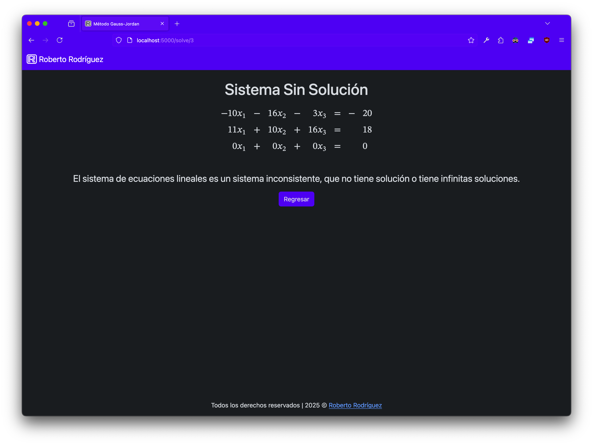

# Gauss-Jordan-Solver
Resuelve sistemas de ecuaciones lineales utilizando el método de Gauss-Jordan.

# Cómo Usar
En la página de inicio, debes ingresar cuántas variables tiene el sistema que deseas resolver.  

Una vez que hayas ingresado el número de variables, debes llenar el sistema o presionar el botón de "Valores Aleatorios" para llenarlo con números aleatorios.  

Después de completar el sistema y presionar el botón "Resolver", el algoritmo procesará el sistema y mostrará todos los pasos realizados para obtener la solución. Finalmente, mostrará la conclusión con los valores de las variables encontradas.  

En caso de que el sistema no tenga solución, el algoritmo lo indicará.  
